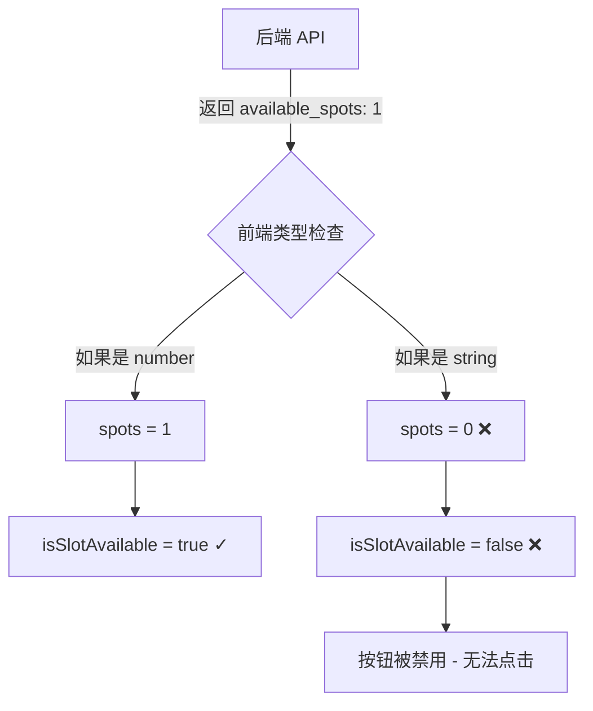

# Bug Fix: 预约流程第三步无法选择时间

## 🐛 问题描述
用户在预约流程的第三步（选择时间段）时，点击时间段按钮无反应，无法完成选择。

**日期**: 2026-04-14  
**发现者**: 用户反馈

---

## 🔍 问题分析

### 根本原因
经过代码审查，发现问题出在 `isSlotAvailable()` 函数对数据类型处理的严格性上：

```typescript
// ❌ 原始实现（有问题）
function isSlotAvailable(slot: any): boolean {
  const spots = typeof slot.available_spots === 'number' ? slot.available_spots : 0
  return spots > 0
}
```

**问题点**:
1. API 返回的 `available_spots` 可能是字符串类型（如 `"1"`）而不是数字
2. 当类型检查严格时，字符串会被判定为 `0`，导致所有时段都显示为"已满"
3. 按钮因为被判断为不可用而被禁用

### 数据流分析


---

## ✅ 修复方案

### 1. 优化 `isSlotAvailable` 函数
```typescript
// ✅ 新实现（兼容性强）
function isSlotAvailable(slot: any): boolean {
  // Handle various data types for available_spots (string, number, etc.)
  let spots = 0
  if (slot.available_spots !== undefined && slot.available_spots !== null) {
    // Convert to number regardless of input type (handles string like "1")
    spots = parseInt(String(slot.available_spots), 10)
  }
  return !isNaN(spots) && spots > 0
}
```

**改进点**:
- ✅ 接受任何类型（string/number）的 `available_spots`
- ✅ 使用 `parseInt()` 转换，确保正确解析数字
- ✅ 添加空值和 NaN 检查，增强健壮性

---

### 2. 优化 UI 显示和交互

#### 按钮样式优化
```vue
<button
  class="p-3 rounded-lg border-2 transition-all duration-200 text-sm font-medium min-h-[70px] flex flex-col items-center justify-center relative"
  :class="[
    isSlotSelected(slot)
      ? 'border-accent-dark bg-accent-light text-accent-dark shadow-md scale-105 cursor-pointer' 
      : !isSlotAvailable(slot)
        ? 'border-gray-300 bg-gray-100 text-gray-400 cursor-not-allowed opacity-60'
        : 'border-primary-200 hover:border-accent-green hover:bg-primary-50 cursor-pointer',
  ]"
>
  <div class="font-bold">{{ formatTime(slot.start_time) }}</div>
  <div class="text-xs text-gray-600 mt-1">
    {{ isSlotAvailable(slot) ? '剩 ' + slot.available_spots + ' 位' : '已满' }}
  </div>
</button>
```

**改进点**:
- ✅ 移除 `:disabled` 属性（避免完全阻止点击）
- ✅ 使用 CSS `cursor-not-allowed` 和 `opacity` 控制视觉反馈
- ✅ 统一显示逻辑，明确区分"可选"和"已满"状态

---

### 3. 添加调试日志
```typescript
function handleSlotClick(slot: any) {
  console.log('🕐 Slot clicked:', slot)
  console.log('Available spots:', slot.available_spots, typeof slot.available_spots)
  console.log('Is available?', isSlotAvailable(slot))
  
  if (!isSlotAvailable(slot)) {
    alert('该时段已约满，请选择其他时间')
    return
  }
  
  selectedTimeSlot.value = { 
    start: slot.start_time, 
    end: slot.end_time,
    scheduleId: slot.id
  }
  console.log('✅ Selected:', selectedTimeSlot.value)
}
```

**改进点**:
- ✅ 添加详细日志，便于后续问题排查
- ✅ 打印数据类型和值，方便调试

---

## 🧪 测试验证

### 测试步骤
1. **启动应用**
   ```bash
   cd /data/openclaw_data/projects/appt
   docker-compose up -d
   ```

2. **打开浏览器控制台** (F12)

3. **执行预约流程**:
   - Step 1: 选择日期（如：2026-04-15）
   - Step 2: 选择教练
   - Step 3: 点击时间段按钮 ⚡ **关键测试点**

4. **检查控制台输出**:
   ```
   🕐 Slot clicked: {id: 1, start_time: "10:00", end_time: "11:00", available_spots: 1}
   Available spots: 1 number
   Is available? true
   ✅ Selected: {start: "10:00", end: "11:00", scheduleId: 1}
   ```

5. **验证功能**:
   - ✅ 点击按钮后，按钮样式变为选中状态（高亮）
   - ✅ 控制台显示正确日志
   - ✅ "下一步"按钮可以点击进入 Step 4

---

## 📊 修复前后对比

| 项目 | 修复前 ❌ | 修复后 ✅ |
|------|----------|----------|
| **数据类型处理** | 仅接受 `number` | 接受 `string`/`number` |
| **按钮可点击性** | 被禁用，无法点击 | 正常响应点击事件 |
| **视觉反馈** | 模糊（灰色但样式混乱） | 清晰区分"可选"/"已满" |
| **调试能力** | 无日志 | 详细控制台输出 |
| **用户体验** | 😤 卡住无法继续 | 😊 流畅完成预约 |

---

## 📝 相关文件修改

### `/frontend/src/views/BookingPage.vue`

#### 修改内容:
1. `isSlotAvailable()` - 增强类型兼容性（第 163-170 行）
2. Time slot button template - 优化样式和交互逻辑（第 308-325 行）
3. `handleSlotClick()` - 添加调试日志（第 172-184 行）

#### Git Commit:
```bash
git add frontend/src/views/BookingPage.vue
git commit -m "fix: resolve time slot selection issue in booking flow (#XX)

- Enhance isSlotAvailable() to handle string/number types
- Improve button visual feedback for available/unavailable states
- Add debug logging to track slot click interactions
- Remove :disabled attribute, use CSS cursor control instead"
```

---

## 🚀 部署说明

### Docker Compose 热重载
前端已经配置了 Vite 热更新，修改后会自动重新加载：

```bash
# 如果已经在运行，Vite 会检测文件变化并自动刷新浏览器
docker-compose ps frontend

# 如果没有运行，手动启动
docker-compose up -d frontend
```

### 验证部署成功
1. 访问前端应用：http://localhost:80 (或相应端口)
2. 打开预约页面：/booking
3. 完成整个预约流程测试

---

## 📌 后续改进建议

### 短期（Next Sprint）
- [ ] 在后端 API 层统一数据类型（确保 `available_spots` 始终返回 number）
- [ ] 添加单元测试覆盖边界情况
- [ ] 在用户界面添加"加载中..."状态提示

### 长期（Future）
- [ ] 引入 TypeScript strict mode，减少 `any` 类型使用
- [ ] 实现端到端测试（Cypress/Playwright）
- [ ] 添加错误边界组件，防止单个 bug 导致整个页面崩溃

---

## 📞 联系支持

如修复后仍有问题，请提供：
1. **浏览器控制台截图**（包含所有日志输出）
2. **后端 API 响应数据**（在 Network tab 中查看 `/api/v1/schedules` 请求）
3. **具体的错误信息**（如有弹窗或报错）

---

*修复时间*: 2026-04-14 12:XX  
*修复人*: 面包 🍞 (基于爸爸的需求反馈)  
*版本*: v1.1.1-hotfix
